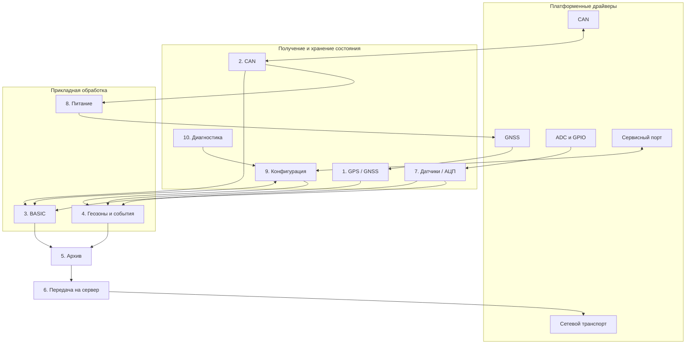

# Архитектура телематического устройства

## 1. Назначение и результат

Проект представляет работающий прототип прошивки автомобильного
телематического устройства с жёстким ограничением в 8 КБ SRAM. Он реализует
все десять функций из задания, связывает их несколькими сквозными потоками
данных и собирается из одного прикладного кода для STM32G030K6T6, Linux и
Windows.

В target-сборке и общей прикладной логике нет RTOS, потоков и динамической
памяти. Одновременность функций обеспечивается кооперативно:
`application::tick()` последовательно вызывает короткие обработчики модулей,
каждый обработчик сохраняет своё состояние и возвращает управление ядру.
Платформенные драйверы заменяются на этапе линковки, поэтому логика модулей не
содержит `#ifdef` для desktop или микроконтроллера.

Главные архитектурные свойства:

- десять функций задания действительно участвуют в работе системы;
- объём всех очередей, журналов, программы и таблиц ограничен константами;
- статическая память target-сборки занимает 1612 байт;
- стеку выделена отдельная область размером 2 КБ;
- входы и выходы desktop-версии доступны через детерминированный JSONL-стенд;
- сквозные и модульные сценарии выполняются на Linux и Windows при каждом PR;
- та же версия исходников отдельно собирается как bare-metal прошивка.

## 2. Десять функций из задания

Модулем ниже называется функциональная единица из задания. Она не обязана
соответствовать ровно одному файлу: например, движок событий состоит из
обработки геозон и фронтов дискретных входов, а архив и передатчик делят одну
структуру, чтобы не хранить одно сообщение дважды.

| № | Функция из задания | Реализация | Глубина реализации |
|---:|---|---|---|
| 1 | GPS / GNSS | `navigation.cpp`, драйвер GNSS | Координаты, скорость, достоверность, периодический опрос |
| 2 | CAN | `vehicle.cpp`, `obd2.cpp`, драйвер CAN | OBD-II: скорость, обороты, температура, топливо, Check Engine |
| 3 | Интерпретатор скриптов | `script.cpp` | Ограниченный BASIC, переменные, условия, вычисления и `SEND` |
| 4 | Движок геозон и событий | `geofences.cpp`, `sensor_events.cpp` | Три геозоны, вход/выход, фронты датчиков; превышение скорости задаётся BASIC-скриптом |
| 5 | Архив | очередь в `server_transmission.cpp` | Четыре записи, удаление самой старой при переполнении |
| 6 | Передача данных на сервер | `server_transmission.cpp`, драйвер транспорта | Накопление без связи, последовательная отправка и счётчики |
| 7 | Опрос датчиков / АЦП | `sensors.cpp`, драйвер датчиков | Два аналоговых и три дискретных входа |
| 8 | Управление питанием | `power_management.cpp`, драйвер питания | Постоянная или периодическая работа GNSS по состоянию двигателя |
| 9 | Конфигурация | `configuration.cpp`, сервисный драйвер | Чтение, проверка и атомарное применение параметров |
| 10 | Диагностика / лог / watchdog | `diagnostics.cpp` | Счётчики, четыре записи журнала и контроль heartbeat |

Вспомогательные `event_messages.cpp` и `application.cpp` не добавляют
одиннадцатую функцию. Первый унифицирует идентификаторы событий, второй
является ядром, которое планирует перечисленные десять функций.

## 3. Модули и потоки данных



Обмен не основан на общей динамической шине сообщений. Для текущих состояний
используются маленькие типизированные снимки с номером ревизии. События,
которые нельзя потерять между двумя вызовами, превращаются в записи архива.
Такое разделение не требует универсального брокера и экономит RAM.

### Сквозной сценарий

Основная демонстрация проходит через пять функций:

1. desktop-драйвер принимает CAN-ответ OBD-II;
2. функция CAN декодирует скорость автомобиля;
3. BASIC-программа сравнивает скорость с порогом 130 км/ч;
4. `SEND(SPEED)` создаёт запись в архиве;
5. при доступном транспорте запись передаётся на сервер.

При 120 км/ч сообщение отсутствует. При переходе к 145 км/ч сервер получает
сообщение с кодом `0x20` и значением скорости. В консоли демонстрационного
скрипта видны все команды и ответы процесса.

Дополнительные сценарии проверяют независимые цепочки
`GNSS → геозоны → архив → сервер` и
`GPIO → события → архив → сервер`.

## 4. Бюджет SRAM

### Фактическое распределение статической памяти

Target-сборка ARM GNU Toolchain использует 1612 байт в `RAM_STATIC`. Таблица
ниже раскладывает это число по скомпонованным структурам. Размер архива отделён
от служебных полей передатчика, хотя в коде они входят в один
`TransmissionState`.

| Владелец | Байт | Что хранится |
|---|---:|---|
| 1. GPS / GNSS | 24 | Последняя фиксация и расписание опроса |
| 2. CAN | 28 | Пять параметров автомобиля и расписание OBD-II |
| 3. Интерпретатор | 1200 | Текст 1025 байт, 8 переменных, снимок и ревизии источников |
| 4. Геозоны и события | 22 | Маска зон, исходные уровни входов и общий номер события |
| 5. Архив | 160 | Четыре записи по 40 байт |
| 6. Передача на сервер | 20 | Голова очереди и счётчики |
| 7. Датчики / АЦП | 20 | Пять значений, маска достоверности и расписание |
| 8. Управление питанием | 20 | Режим, таймер фазы и счётчики переходов |
| 9. Конфигурация | 12 | Активные параметры и ревизия |
| 10. Диагностика | 88 | Счётчики, watchdog и четыре записи журнала |
| Ядро и target runtime | 18 | Время, ревизия приложения, SysTick и выравнивание |
| **Итого `RAM_STATIC`** | **1612** | **26,24% области размером 6 КБ** |

Linker script делит физические 8 КБ SRAM:

| Область | Размер | Использование |
|---|---:|---|
| `RAM_STATIC` | 6144 байт | 1612 байт занято, 4532 байта остаётся |
| `RAM_STACK` | 2048 байт | Полностью зарезервировано под стек |
| **Всего** | **8192 байт** | Жёсткая граница адресного пространства |

Строка `RAM_STACK: 100%` в отчёте линкера означает резервирование всей
области, а не измеренную глубину стека. Сборка генерирует `.su`-отчёты функций,
но runtime high-water mark не измеряется. Поэтому 2 КБ являются принятым
бюджетом, а не доказанным фактическим максимумом.

Последняя проверенная target-сборка также занимает 11 360 байт из 32 КБ Flash.

### Как удерживается верхняя граница

- состояния модулей существуют всё время работы и размещаются глобально;
- `new`, `delete`, `malloc` и неограниченные контейнеры в target-логике не
  используются;
- очереди, журнал, число геозон, переменных и длина программы заданы
  константами;
- при переполнении архива удаляется самая старая запись;
- BASIC не содержит циклов, а рекурсия парсера ограничена глубиной выражения;
- исключения, RTTI и потокобезопасная инициализация локальных static отключены;
- linker script останавливает сборку при переполнении `RAM_STATIC`;
- отдельная область не позволяет статическим данным незаметно отнять бюджет
  у стека на этапе линковки.

## 5. Ядро и кооперативная многозадачность

Общий контракт ядра:

```cpp
application::TickResult application::tick(std::uint32_t timestamp_ms);
```

`timestamp_ms` — монотонная 32-битная метка времени. Все интервалы считаются
беззнаковой разностью, поэтому переход через `UINT32_MAX` является штатным.

Внутри одного `tick` модули вызываются в фиксированном порядке:

1. диагностика фиксирует heartbeat;
2. CAN обрабатывает ответы и планирует OBD-II-запросы;
3. управление питанием оценивает свежие обороты двигателя;
4. GPS / GNSS опрашивает включённый приёмник;
5. датчики считывают ADC и GPIO;
6. BASIC видит уже обновлённые параметры автомобиля и датчиков;
7. движок геозон обрабатывает новую фиксацию;
8. обработчик дискретных событий ищет фронты входов;
9. конфигурация обслуживает один сервисный запрос;
10. передатчик отправляет одну архивную запись.

Архив не требует отдельного шага: функции 3 и 4 добавляют в него записи во
время своей работы. Каждая функция выполняет ограниченный объём действий и
возвращает управление. Блокировок, ожидания периферии и вытесняющего
планирования нет.

Это и есть кооперативная многозадачность проекта. Физически C++ выполняется
последовательно, но каждое состояние развивается независимо во времени:

- GPS / GNSS и датчики работают с периодом 100 мс;
- BASIC запускается при изменении источников либо раз в 100 мс;
- OBD-II-запросы формируются раз в секунду;
- питание использует окна 10 и 60 секунд;
- события и отправка реагируют без дополнительной временной задержки.

На STM32 SysTick увеличивает время раз в миллисекунду. Основной цикл вызывает
ядро, повторяет вызов с той же меткой, пока `work_pending == true`, затем
выполняет `wfi`. Повтор нужен, например, чтобы опустошить очередь сервера без
искусственного продвижения времени.

На desktop время виртуально. Одна JSON-команда изменяет вход или время, после
чего раннер вызывает то же ядро до устойчивого состояния. Это делает
проверки детерминированными и не меняет прикладной код.

## 6. Слои и переносимость

| Слой | Каталоги | Ответственность |
|---|---|---|
| Ядро | `include/application`, `src/application.cpp` | Порядок вызова, время и немедленная работа |
| Функциональные модули | `include/modules`, `src` | Все десять функций и статическое состояние |
| Протоколы | `include/protocol`, `src/obd2.cpp` | Декодирование OBD-II независимо от оборудования |
| Драйверные контракты | `include/drivers` | CAN, GNSS, датчики, питание, сервер и сервисный порт |
| STM32 | `platform/stm32g030`, `startup`, `linker` | Bare-metal запуск, SysTick и аппаратные границы |
| Desktop | `platform/desktop` | Управляемые заглушки и JSONL-стенд |
| Проверки | `tests/scenarios`, `tools` | Эталонные сценарии и демонстрационный запуск |

Прикладные файлы входят в обе сборки без платформенных условных веток. CMake
добавляет либо `platform/stm32g030`, либо `platform/desktop`; одинаковые
драйверные функции получают разные реализации на этапе линковки.

## 7. Детали десяти функций

### 7.1. GPS / GNSS

Драйвер возвращает нормализованную фиксацию:

- широту и долготу в градусах, умноженных на `10^7`;
- путевую скорость в сотых долях км/ч;
- признак достоверности.

Целочисленный формат компактен и не смешивает скорость GNSS со скоростью
автомобиля из CAN. Модуль опрашивает включённый приёмник раз в 100 мс,
увеличивает ревизию только при изменении и сбрасывает достоверность при
отключении питания.

Реальный приёмник обычно подключается по UART и передаёт NMEA либо бинарный
протокол. Модель приёмника в задании не задана, поэтому target-драйвер
заканчивается на границе готовой фиксации.

### 7.2. CAN

Драйвер работает с классическим CAN:

- стандартный 11-битный идентификатор;
- полезная нагрузка до восьми байт;
- отдельные операции приёма и отправки.

`COB-ID` не используется: это термин CANopen, а здесь выбран OBD-II поверх CAN.
Общий декодер формирует запросы режима 01 и читает пять параметров:

| Параметр | PID | Представление |
|---|---:|---|
| Обороты двигателя | `0x0C` | об/мин |
| Скорость автомобиля | `0x0D` | км/ч |
| Температура охлаждающей жидкости | `0x05` | °C |
| Уровень топлива | `0x2F` | проценты |
| Лампа Check Engine | `0x01` | флаг MIL |

У каждого параметра есть бит достоверности. Ответы обрабатываются сразу,
пять запросов повторяются раз в секунду.

STM32G030K6 не имеет встроенного CAN-контроллера. В реальном устройстве нужны
внешний контроллер, например по SPI, и CAN-трансивер. Их модели не определены,
поэтому target-драйвер оставлен заглушкой на уровне CAN-кадров. Desktop-драйвер
содержит две фиксированные очереди по 16 кадров.

### 7.3. Интерпретатор скриптов

Программа BASIC хранится одной строкой до 1024 байт и разбирается заново при
запуске. Синтаксическое дерево не сохраняется, что меняет Flash и процессорное
время на экономию RAM.

| Ресурс | Ограничение |
|---|---:|
| Длина программы | 1024 байта |
| Длина строки | 96 символов |
| Пользовательские переменные | 8 |
| Длина имени | 8 символов |
| Вложенность `IF` | 4 |
| Вложенность выражений | 2 |

Все переменные имеют тип `float`. Поддержаны присваивание, `+`, `-`, `*`, `/`,
скобки, сравнения и блоки `IF / THEN / ELSE / END IF`. Циклов, переходов,
массивов и пользовательских функций нет.

Встроенные переменные:

| Имя | Доступ | Привязка |
|---|---|---|
| `TIME` | чтение | Время ядра |
| `SPEED` | чтение | Скорость из CAN |
| `RPM` | чтение | Обороты из CAN |
| `IGNITION` | чтение | Дискретный вход зажигания |
| `GEOFENCE` | чтение и запись | Включение геозон |
| `LOGCODE` | запись | Диагностический журнал |

`SEND(value)` помещает в архив код `0x20` и знаковое 32-битное значение.
Ошибка загрузки запрещает запуск, а деление на ноль или выход за числовой
диапазон останавливают программу до сброса либо новой загрузки.

Программа `examples/overspeed.bas` отправляет одно событие при переходе выше
130 км/ч и разрешает повтор только после возврата к порогу или ниже.

### 7.4. Движок геозон и событий

Движок содержит три прямоугольные геозоны. Для достоверной фиксации вычисляется
трёхбитная маска принадлежности. После первой точки каждый вход и выход создаёт
запись с кодом события, зоной, временем, координатами и скоростью.

Потеря фиксации не создаёт ложный выход. Отключение геозон через конфигурацию
сбрасывает baseline, а последующее включение безопасно начинает наблюдение
заново.

В ту же функциональную область входит обработчик дискретных событий. Он
запоминает исходный уровень зажигания, двери и тревоги и создаёт событие только
на наблюдаемом фронте `0 → 1`. Превышение скорости реализовано не второй
копией логики, а пользовательской BASIC-программой.

### 7.5. Архив

Архив хранит четыре ещё не переданные записи. Одна запись содержит:

- 32-битный идентификатор;
- длину;
- до 32 байт полезной нагрузки.

Если поступает пятая запись, удаляется самая старая, новая сохраняется, а
счётчик потерь увеличивается. Порядок оставшихся записей не меняется.

Архив энергозависим и находится в RAM. Сохранение во Flash, wear leveling и
восстановление после сброса не реализованы, потому что тип внешней памяти и
требования к ресурсу записи отсутствуют. Функционально архив отделён от
передатчика, но физически использует ту же структуру и тем самым избегает
двойного буфера.

### 7.6. Передача данных на сервер

Транспорт принимает готовое логическое сообщение. UART-команды модема,
TCP/UDP, HTTP и серверный протокол не зафиксированы в задании и не попадают в
общий контракт.

Без связи записи остаются в архиве. При доступном канале за один `tick`
передаётся одна запись. Если очередь ещё не пуста, ядро получает
`work_pending` и повторяет шаг с тем же временем.

В реальном терминале модем часто подключается по UART, но эмуляция конкретных
AT-команд без выбранного оборудования проверяла бы вымышленный протокол.
Target-драйвер поэтому недоступен, а desktop-драйвер позволяет сценарию
включать связь и наблюдать `server_tx`.

### 7.7. Опрос датчиков / АЦП

Раз в 100 мс опрашиваются:

| Вход | Представление |
|---|---|
| Напряжение питания | Сырой ADC `0..4095` |
| Внешний аналоговый вход | Сырой ADC `0..4095` |
| Зажигание | Логический уровень |
| Открытие двери | Логический уровень |
| Тревога | Логический уровень |

Маска достоверности отличает ноль от отсутствующего измерения. Аналоговые
значения остаются сырыми: коэффициенты делителей, опорное напряжение и
калибровка зависят от неизвестной платы. Уровень топлива здесь намеренно не
дублируется — он поступает только из CAN.

### 7.8. Управление питанием

Свежие ненулевые обороты двигателя удерживают GNSS включённым. Когда двигатель
остановлен, приёмник:

1. работает 10 секунд для получения фиксации;
2. отключается на 60 секунд;
3. снова включается на короткое окно.

Состояние оборотов считается устаревшим через пять секунд. Немедленный запуск
двигателя переводит GNSS в постоянный режим. Драйвер питания представляет
логический домен GNSS; вывод, внешний ключ и полярность платы не придуманы.

### 7.9. Конфигурация

Активная конфигурация содержит:

- включение геозон;
- тайм-аут watchdog от 100 до 10 000 мс;
- номер ревизии.

Сервисный запрос сначала полностью проверяется и только затем атомарно меняет
активный снимок. Через тот же сервисный порт читаются конфигурация,
диагностические счётчики и журнал. Кадры ограничены 32 байтами.

Физическим интерфейсом мог бы быть UART, но это не определено заданием.
Target-драйвер оставляет границу на уровне короткого бинарного кадра,
desktop-драйвер использует две очереди по восемь кадров.

### 7.10. Диагностика / лог / watchdog

Диагностика считает:

- heartbeat ядра и срабатывания watchdog;
- успешные и отклонённые изменения конфигурации;
- ошибки сервисного протокола;
- вытесненные записи журнала.

Кольцевой журнал хранит четыре последние записи: время, код и 32-битный
аргумент. При переполнении удаляется самая старая.

Watchdog здесь программный: он обнаруживает слишком большой интервал между
двумя различными метками `tick`. Реальный независимый аппаратный watchdog и
сброс микроконтроллера не настраиваются, поскольку цель модуля — наблюдаемая и
тестируемая логика контроля.

## 8. Desktop-стенд

Desktop-приложение является однопоточным JSONL-процессом:

- одна строка `stdin` содержит одну команду JSON;
- каждая строка `stdout` содержит одно сообщение JSON;
- диагностика процесса направляется в `stderr`;
- время изменяется только командами стенда;
- ответ одной команды завершается сообщением `done`.

Поддержанные команды:

| Команда | Данные | Действие |
|---|---|---|
| `tick` | `timestamp_ms` | Установить время и выполнить ядро |
| `advance` | `milliseconds` | Продвинуть время |
| `can_rx` | `can_id`, `data` | Подать CAN-кадр |
| `adc_set` | `channel`, `adc_value` | Установить ADC |
| `digital_set` | `channel`, `active` | Установить GPIO |
| `gnss_set` | координаты, скорость, `valid` | Установить GNSS-фиксацию |
| `service_rx` | `service_data` | Подать сервисный кадр |
| `server_enqueue` | `message_id`, `payload` | Добавить запись напрямую |
| `server_online` | `online` | Изменить доступность сервера |
| `power_snapshot` | — | Получить состояние питания |
| `script_load` | `program` | Загрузить BASIC |
| `script_snapshot` | — | Получить состояние BASIC |
| `snapshot` | — | Получить полный снимок |
| `reset` | — | Сбросить приложение |
| `shutdown` | — | Завершить процесс |

Состояния имеют ревизии. Обычный ответ содержит только изменившиеся части,
поэтому длинные снимки не повторяются после каждой команды. `snapshot`
принудительно возвращает полное состояние. За одну команду допускается не
более 1024 последовательных вызовов ядра; превышение считается зацикливанием.

## 9. Проверка и постоянный контроль

`tools/run_scenarios.py` запускает отдельный процесс для каждого JSON-сценария,
посылает команды, читает ответы до `done` и сравнивает разобранные объекты с
эталоном. Каждое чтение ограничено тайм-аутом.

Десять сценариев покрывают:

| Сценарий | Основная область |
|---|---|
| `basic.json` | Ядро, время, снимки, сброс и переполнение таймера |
| `can.json` | CAN, OBD-II и пять параметров автомобиля |
| `gnss_geofences.json` | GNSS, три геозоны, архив и сервер |
| `server_transport.json` | Архив, переполнение и восстановление связи |
| `sensors.json` | ADC, GPIO, фронты событий и сервер |
| `power_management.json` | CAN, питание и периодическая работа GNSS |
| `service_configuration.json` | Конфигурация, диагностика, журнал и watchdog |
| `configuration_geofences.json` | Влияние конфигурации на геозоны |
| `script_language.json` | BASIC, встроенные переменные и ошибки |
| `script_overspeed.json` | Сквозное событие превышения скорости |

Дополнительно `tools/demo_end_to_end.py` выполняет наглядный сквозной сценарий
и печатает все отправленные и полученные JSON-строки.

GitHub Actions запускается для каждого коммита в PR и в `master`:

1. собирает и тестирует desktop-версию на Linux;
2. собирает и тестирует desktop-версию на Windows;
3. собирает bare-metal прошивку STM32G030;
4. разрешает общий quality gate только после успеха всех трёх задач.

Проверки являются детерминированными процессными сценариями. Они глубоко
проверяют ядро и межмодульные потоки, но не используют GoogleTest, Catch2 или
doctest и по гранулярности ближе к интеграционным тестам, чем к классическим
изолированным unit-тестам.

## 10. Допущения и компромиссы

| Решение | Причина и следствие |
|---|---|
| Кооперативная модель вместо RTOS | Нет стеков десяти задач, блокировок и недетерминированной памяти; долгий обработчик задержал бы остальные |
| Архив и передатчик делят структуру | Экономится второй буфер; в исходниках это не два независимых класса |
| Архив только в RAM | Нет выдуманной Flash-микросхемы; записи теряются при сбросе |
| Аппаратные target-драйверы являются заглушками | ТЗ не задаёт плату, модем, GNSS и CAN-контроллер; заглушена периферия, но не логика функций |
| Три прямоугольные геозоны | Достаточно для демонстрации переходов без динамической геометрии |
| Сырые значения ADC | Нет схемы входных цепей и калибровки |
| Логический серверный транспорт | Не придумываются UART-команды модема и сетевой протокол |
| Ограниченный BASIC без циклов | Время выполнения и память имеют верхнюю границу |
| Стек без runtime high-water контроля | Есть область 2 КБ и отчёты компилятора, но нет аппаратной защиты от переполнения |
| Сценарные тесты вместо xUnit | Лучше проверяются реальные потоки между функциями, но это отклонение от буквального требования о unit-фреймворке |
